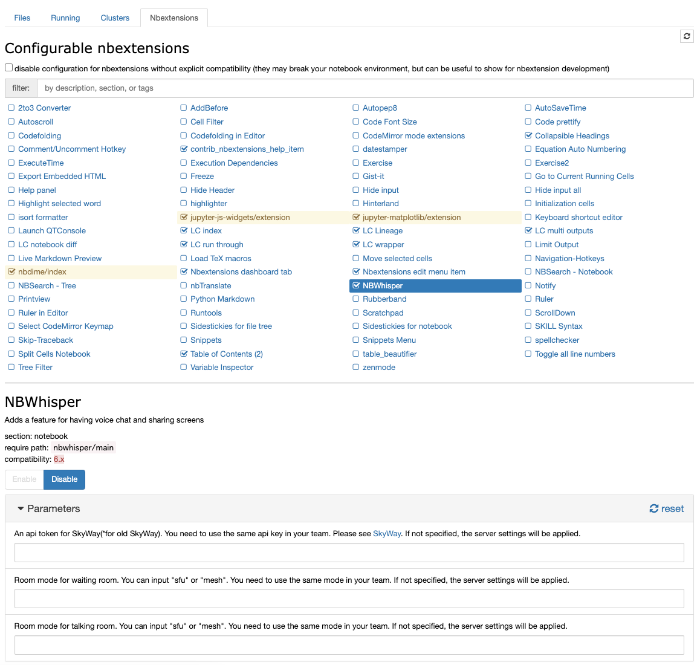

## NBWhisper
This nbextension allows using WebRTC in your blowser. You can talk with your voice and share your blowser tab you are editting by WebRTC. WebRTC services are offered by SkyWay.

### SkyWay Website
https://skyway.ntt.com/ja/

### options

You can specify the following items either from `jupyter_notebook_config.py` or from the Jupyter Nbextensions Configurator.

`An api token for SkyWay.`<br>
Input your api token offered by SkyWay. This nbextension is not compatible with new SkyWay service, but old one. You can get an api token from your old SkyWay admin page.<br>
https://console-webrtc-free.ecl.ntt.com/users/login<br>
- You must input a domain of your OperationHub page in available domain names.
- You can connect to only users who have the same api key. You must input the same token with your team members.

`Room mode for waiting room.`<br>
Input "sfu" or "mesh" as waiting room mode you want to use.
- You must input the same mode with your team members.

`Room mode for talking room.`<br>
Input "sfu" or "mesh" as talking room mode you want to use.
- You must input the same mode with your team members.<br>

#### Configuration on jupyter_notebook_config.py

```
c.NBWhisper.skyway_api_token = 'An api token for SkyWay'
c.NBWhisper.room_mode_for_waiting_room = 'Room mode for waiting room'
c.NBWhisper.room_mode_for_talking_room = 'Room mode for talking room'
```

#### Configuration on the Jupyter Nbextensions Configurator

