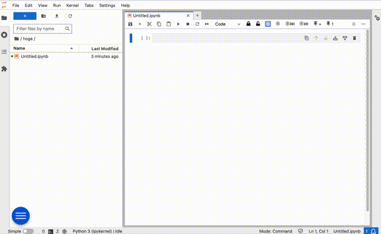
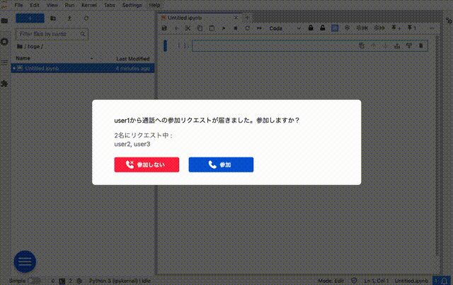
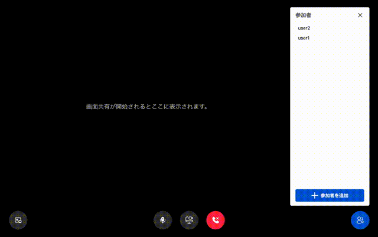
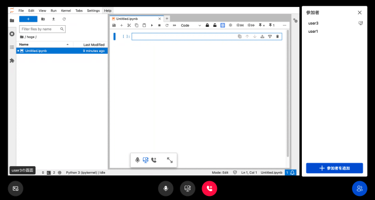
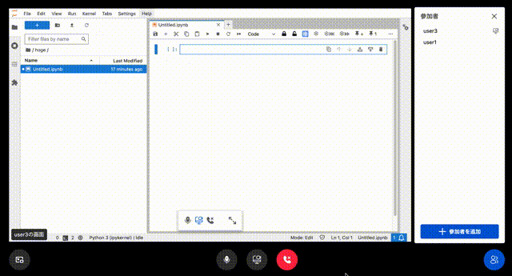
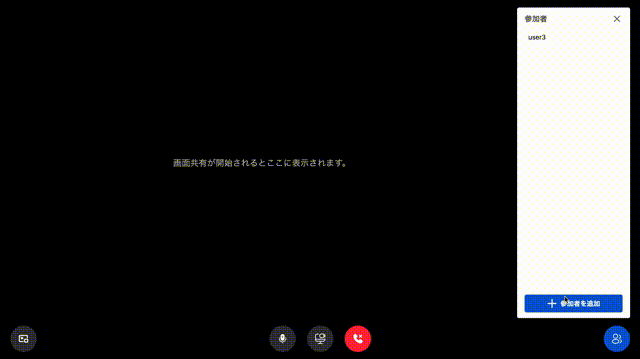
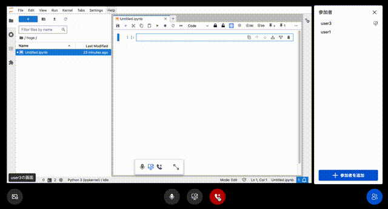

# nbwhisper

[](https://github.com/miya-biz/Jupyter-LC_nbwhisper/actions/workflows/build.yml)
A JupyterLab extension.

This nbextension allows using WebRTC in your blowser. You can talk with your voice and share your blowser tab you are editting by WebRTC. WebRTC services are offered by "WebRTC SFU Sora".

## WebRTC SFU Sora Website

[https://sora.shiguredo.jp/](https://sora.shiguredo.jp/)

## Requirements

- JupyterLab >= 4.0.0

## Install

To install the extension, execute:

```bash
pip install nbwhisper
```

## Uninstall

To remove the extension, execute:

```bash
pip uninstall nbwhisper
```

## Troubleshoot

If you are seeing the frontend extension, but it is not working, check
that the server extension is enabled:

```bash
jupyter server extension list
```

If the server extension is installed and enabled, but you are not seeing
the frontend extension, check the frontend extension is installed:

```bash
jupyter labextension list
```

## Contributing

### Development install

Note: You will need NodeJS to build the extension package.

The `jlpm` command is JupyterLab's pinned version of
[yarn](https://yarnpkg.com/) that is installed with JupyterLab. You may use
`yarn` or `npm` in lieu of `jlpm` below.

```bash
# Clone the repo to your local environment
# Change directory to the nbwhisper directory
# Install package in development mode
pip install -e ".[test]"
# Link your development version of the extension with JupyterLab
jupyter labextension develop . --overwrite
# Server extension must be manually installed in develop mode
jupyter server extension enable nbwhisper
# Rebuild extension Typescript source after making changes
jlpm build
```

You can watch the source directory and run JupyterLab at the same time in different terminals to watch for changes in the extension's source and automatically rebuild the extension.

```bash
# Watch the source directory in one terminal, automatically rebuilding when needed
jlpm watch
# Run JupyterLab in another terminal
jupyter lab
```

With the watch command running, every saved change will immediately be built locally and available in your running JupyterLab. Refresh JupyterLab to load the change in your browser (you may need to wait several seconds for the extension to be rebuilt).

By default, the `jlpm build` command generates the source maps for this extension to make it easier to debug using the browser dev tools. To also generate source maps for the JupyterLab core extensions, you can run the following command:

```bash
jupyter lab build --minimize=False
```

### Development uninstall

```bash
# Server extension must be manually disabled in develop mode
jupyter server extension disable nbwhisper
pip uninstall nbwhisper
```

In development mode, you will also need to remove the symlink created by `jupyter labextension develop`
command. To find its location, you can run `jupyter labextension list` to figure out where the `labextensions`
folder is located. Then you can remove the symlink named `nbwhisper` within that folder.

### Testing the extension

#### Server tests

This extension is using [Pytest](https://docs.pytest.org/) for Python code testing.

Install test dependencies (needed only once):

```sh
pip install -e ".[test]"
# Each time you install the Python package, you need to restore the front-end extension link
jupyter labextension develop . --overwrite
```

To execute them, run:

```sh
pytest -vv -r ap --cov nbwhisper
```

#### Frontend tests

This extension is using [Jest](https://jestjs.io/) for JavaScript code testing.

To execute them, execute:

```sh
jlpm
jlpm test
```

#### Integration tests

This extension uses [Playwright](https://playwright.dev/docs/intro/) for the integration tests (aka user level tests).
More precisely, the JupyterLab helper [Galata](https://github.com/jupyterlab/jupyterlab/tree/master/galata) is used to handle testing the extension in JupyterLab.

More information are provided within the [ui-tests](./ui-tests/README.md) README.

### Packaging the extension

See [RELEASE](RELEASE.md)

## Usage

### options

You can specify the following items from `jupyter_notebook_config.py`.

`signaling_url`<br>
シグナリングサーバーのURLを入力します。
- 複数存在する場合はカンマ(,)で区切って入力してください。

`api_key`<br>
API認証キーを入力します。

`channel_id_prefix`<br>
WebRTC SFUで使用するチャンネル名の先頭に付与する文字列を入力します。
- 同じチャンネルに接続するユーザー間で一致させる必要があります。

`channel_id_suffix`<br>
WebRTC SFUで使用するチャンネル名の末尾に付与する文字列を入力します。
- 同じチャンネルに接続するユーザー間で一致させる必要があります。
- WebRTCサーバーとして[Sora Cloud](https://sora-cloud.shiguredo.jp/)を使用する場合は、`@プロジェクト名`にする必要があります。

`share_current_tab_only`<br>
画像共有時にカレントタブのみ共有するかどうかを設定します。
- Trueにすると、画面共有時にどの画面を共有するかの選択はできず、カレントのタブを共有します。
- Falseにすると、画面共有時にどの画面を共有するかの選択ダイアログを表示します。
- これらはブラウザの種類やバージョンによって動作が異なる、あるいは設定しても動作が変わらない場合があります。

`default_username`<br>
環境変数で設定していない場合に使われるユーザー名を入力します。
- ユーザー名は環境変数`JUPYTERHUB_USER`で設定したものが優先して使われます。

#### Configuration on jupyter_notebook_config.py

```
c.NBWhisper.signaling_url ='wss://0001.sora.sora-cloud.shiguredo.app/signaling,wss://0002.sora.sora-cloud.shiguredo.app/signaling,wss://0003.sora.sora-cloud.shiguredo.app/signaling'
c.NBWhisper.api_key = 'apikey'
c.NBWhisper.channel_id_prefix = 'prefix-'
c.NBWhisper.channel_id_suffix = '@project_name'
c.NBWhisper.share_current_tab_only = True
```

### 通話

#### ユーザーを呼び出す
- ボタンをクリックすると、ユーザーリストが表示されます。
- 呼び出したいユーザーをクリックして選択します。
- 「通話をリクエスト」をクリックして「送信」をクリックします。
- 呼び出し中画面に遷移します。



#### ユーザーから呼び出される
- 呼び出されたユーザーには通知ダイアログが表示されます。
- 「参加」をクリックします。
- 通話画面に遷移して通話が開始されます。呼び出した側のユーザーも通話画面に遷移します。



#### 画面共有
- 「画面を共有」ボタンをクリックすると、通話画面が最小化されます。
- ブラウザの画面共有設定を行います。
- 自分の画面を通話中の他のユーザーと共有します。
- 同時に共有できるのは1人だけで、他のユーザーが画面共有を開始すると、自分の画面共有は終了します。
- 共有中に通話画面を表示することはできません。この場合は画面共有は終了します。





#### 最小化
- 「最小化」ボタンをクリックすると、通話画面を最小化して編集作業を行うことができます。
- 他のユーザーが共有中の画面は右上に表示されます。



#### ミュート
- 「マイクをオフ」ボタンをクリックすると、自分の声が相手に聞こえなくなります。

#### 参加者を追加
- 「参加者を追加」ボタンをクリックすると、通話にいないユーザーのリストが表示されます。
- 呼び出したいユーザーをクリックして選択します。
- 「参加をリクエスト」をクリックして「送信」をクリックします。
- 呼び出されたユーザーが参加を許諾すると、ユーザーが通話に参加します。



#### 退出
- 「通話から退出」ボタンをクリックすると、通話から抜けます。
- 自分以外のユーザーが通話から抜けると、自動的に通話が終了します。

